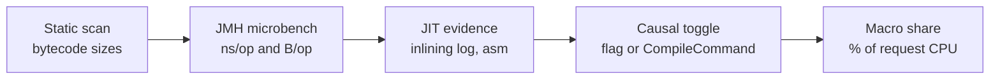

> The brief of the fifth phase, as it was written on 2026-09-19, before any research, **unedited**.
> [research-jit-constructs](research-jit-constructs.md) marks which of its premises held, which
> turned over and which stayed hypotheses. Code anchor: none — the document precedes its code; the
> stand it would be measured on is `bench/profile/run.sh`, inherited from the second phase.

# Research brief: JIT behaviour on Kotlin/JVM service hot paths

2026-09-19 · @Someone

## Question

Which Kotlin/JVM constructs on the request path of a Ktor + Exposed service does HotSpot C2 optimise well, which badly, and does any of it matter next to I/O?

The third part decides whether the study is worth running. A service with a database spends most of its latency waiting, so a JIT effect can be real and still irrelevant. The detailed work is therefore gated behind a macro-level check (see Kill criteria).

The output is a list of constructs. Each one gets a verdict, the evidence behind it, and its cost as a share of request CPU. The three possible verdicts:

- **Green:** C2 handles it well; no action needed.
- **Red:** C2 handles it badly and the cost is visible in the service profile.
- **Grey:** C2 handles it badly, but the cost is below the relevance threshold in a real service.

## Fixed setup

One stack, no matrix. Every version is pinned in the repo before the first measurement and not changed afterwards.

| Layer | Choice | Reason |
| --- | --- | --- |
| HTTP | Ktor 3.x, Netty engine | The most common production configuration |
| Serialisation | kotlinx.serialization, JSON | Generated serialisers, no reflection |
| Data | Exposed DSL over JDBC, HikariCP, PostgreSQL | The most common Kotlin SQL setup |
| JVM | HotSpot, JDK 25 (LTS), tiered compilation with C2, G1, default flags | Defaults are what people run |
| Host | One Linux x86-64 machine, fixed CPU governor, load generator on separate pinned cores | `perf` and `perfasm` need Linux |

The data layer runs in two modes:

- **Real:** PostgreSQL on the same host. This gives the share of framework CPU in a realistic request.
- **Stub:** the repository returns pre-built rows. This isolates the CPU path from network wait.

Four endpoints cover the request shapes:

| Endpoint | What it exercises |
| --- | --- |
| `GET /plaintext` | The Ktor pipeline alone; the floor |
| `GET /items/{id}` | Routing, one query, one row mapped, JSON out |
| `GET /items?limit=50` | Row mapping and serialisation at volume |
| `POST /items` | JSON in, validation, transaction, insert |

Load is open-loop at a constant rate, set to 50–70% of the saturation throughput of each endpoint. Measurement starts only after JFR shows no C2 compilations for 60 seconds.

## Non-goals

- **MongoDB.** The coroutine driver wraps a reactive-streams driver and has its own codec question (`bson-kotlin` on kotlin-reflect vs `bson-kotlinx`). That is a separate study with the same method.
- **Other runtimes and compilers.** No GraalVM JIT, no Native Image, no Kotlin/Native, no OpenJ9.
- **Framework comparison.** No Spring, no http4k, no Ktor CIO engine. The study ranks constructs, not frameworks.
- **Exposed R2DBC and the DAO layer.** DSL over JDBC only. The DAO layer enters only if RQ4 is red and time remains.
- **GC tuning.** G1 with defaults. Allocation rate is measured; collector behaviour is not studied.
- **Startup and warmup time.** Only steady state is measured. Time to steady state is recorded as a side number and not analysed.
- **Scheduling cost.** The thread hop under `withContext(Dispatchers.IO)` is measured only to subtract it. It is not a JIT effect.
- **Fixes.** No patches to Ktor, Exposed or kotlinx libraries. Findings that look actionable become upstream tickets after the study.

## Method

Every candidate passes the same five-step chain, and a verdict needs all five. A log line alone is an observation, not a cost.

The toggle step is what separates this from a descriptive study. Forcing or forbidding the optimisation shows what it is worth.

Two thresholds are fixed now and apply to every research question:

- **Micro effect:** the toggle changes ns/op or B/op by at least 10%, with non-overlapping 99% confidence intervals.
- **Macro relevance:** the construct accounts for at least 2% of request CPU in stub mode, by async-profiler samples or by the toggle's effect on CPU per request.

A construct is red when both hold, grey when only the micro effect holds, and green when neither does.

### Calibration controls

Five constructs are expected to be green. They run through the same chain first:

- `inline` functions with lambdas
- `Intrinsics.checkNotNull*` parameter checks
- `when` over a sealed hierarchy
- `for` loops over ranges and arrays
- data class accessors and `copy`

If any control comes out red, the harness is suspect. Work stops until the cause is found.

## Research questions

RQ0 is the gate; RQ1–RQ7 run only if it is green. Outcomes are declared before any measurement and are not edited afterwards.

| RQ | Question | Green | Red |
| --- | --- | --- | --- |
| RQ0 | In real mode, what share of p50 request latency is CPU time in JVM code of the application, Ktor, Exposed, serialisation and the JDBC driver? | At least 10% on two or more of the three database endpoints | Below 10% on all three; see Kill criteria |
| RQ1 | Do hot methods cross the size limits: 325 bytes of bytecode (`FreqInlineSize`) and 8000 bytes (`DontCompileHugeMethods`)? The suspects are `invokeSuspend` bodies inflated by inline calls such as `transaction {}`. | No method above 8000 bytes in the top 95% of CPU samples, and size-based inlining refusals cover under 2% of CPU | Any hot method left uncompiled, or raising `FreqInlineSize` meets both thresholds |
| RQ2 | What do the megamorphic call sites built into the plumbing cost? `BaseContinuationImpl.resumeWith` calls every `invokeSuspend` in the application; the Ktor pipeline calls every interceptor from one site. | Both sites together under 2% of request CPU | 2% or more, and the microbench with 1, 2 and 8 receiver types shows the 10% step |
| RQ3 | On the fast path, where a suspend function does not suspend, does escape analysis remove the continuation and the boxed primitives? | B/op of a non-suspending suspend chain is within 10% of the same chain as plain calls | Allocation per call persists, and continuation plus boxing allocations reach 2% of request CPU |
| RQ4 | How much of Exposed's per-request cost is a JIT failure rather than work? Suspects: `ResultRow` as `Array<Any?>`, megamorphic `IColumnType.valueFromDB`, query tree and SQL string built per call. | CPU per request within 1.5× of hand-written JDBC for the same query in stub mode | Above 1.5×, and at least a third of the gap traces to failed inlining, megamorphic dispatch or failed scalar replacement |
| RQ5 | Which Kotlin codegen patterns defeat C2? Value classes through generics, nullable types and interfaces; capturing non-inline lambdas; `$default` methods; collection chains vs `Sequence`; delegated properties. | Per pattern: neither threshold met | Per pattern: both thresholds met |
| RQ6 | In a JSON-only service, do the `Encoder` and `Decoder` interface calls in generated serialisers stay monomorphic or bimorphic and inline? | The inlining log shows the JSON encoder methods inlined into generated serialisers on the list endpoint | Virtual or interface calls remain at those sites and meet both thresholds; sealed-class polymorphic serialisation is reported separately |
| RQ7 | Is steady state stable? Recurring deoptimisations, profile pollution in shared generic code, exceptions used as control flow (`CancellationException`, StatusPages). | Under 1 deoptimisation per minute after warmup, and exception construction under 2% of request CPU | A deoptimisation recurring at the same site, or exception construction at 2% or more |

One distinction holds for every row. A construct can be expensive because it does a lot of work, or because C2 failed to optimise it. Only the second is a finding of this study. The first is recorded as library cost and left alone.

## Kill criteria

The study stops, and the stop is published as the result, in any of these cases:

1. **RQ0 is red.** CPU time in JVM code takes under 10% of p50 request latency on all three database endpoints in real mode. The conclusion is that JIT behaviour is not a practical concern for this class of service. Stub-mode work is not started.
2. **A calibration control is red and the cause is not found within two working days.** The harness cannot be trusted, so no candidate verdict can be.
3. **Run-to-run noise exceeds the micro threshold.** If five identical runs of the same JMH benchmark on the fixed host differ by more than 5% in ns/op, a 10% effect cannot be claimed. The host setup is fixed first or the study ends.
4. **Three RQs in a row come out green or grey.** The remaining ones are dropped, and the write-up says the stack is well served by C2.

Per candidate, the budget is one working day from microbench to toggle. A candidate that cannot be isolated in a microbench within that day is recorded as "not isolated" with the reason, and skipped.

## Tooling

Each tool is there for one kind of evidence.

| Step | Tool | Evidence |
| --- | --- | --- |
| Static scan | A small ASM script over the runtime classpath | Bytecode size per method; the list above 325 and above 8000 bytes |
| Load | wrk2 or k6 at constant arrival rate | Latency without coordinated omission |
| Macro CPU and allocation | async-profiler, `cpu` and `alloc` modes | Flame graphs; share of request CPU per construct; wall-clock mode for the RQ0 number |
| Macro JIT events | JFR: `jdk.Compilation`, `jdk.CompilerInlining`, `jdk.Deoptimization`, `jdk.CompilationFailure` | Compiler behaviour on the live service without diagnostic flags |
| JIT log | `-XX:+UnlockDiagnosticVMOptions -XX:+LogCompilation -XX:+PrintInlining`, read in JITWatch | The stated reason for each inlining refusal |
| Micro time and allocation | JMH with `-prof gc` | ns/op and B/op; B/op is the proxy for scalar replacement |
| Micro assembly | JMH `-prof perfasm` with hsdis, `-prof perfnorm` | The compiled hot loop; hardware counters per operation |

Suspend code is not benchmarked through `runBlocking`, which measures the event loop. Benchmarks use `startCoroutineUninterceptedOrReturn` with a hand-written `Continuation`.

The causal toggles per research question:

| RQ | Toggle |
| --- | --- |
| RQ1 | `-XX:FreqInlineSize`, `-XX:-DontCompileHugeMethods`, splitting the suspend function by hand |
| RQ2 | Receiver-type count 1, 2, 8 in the microbench; `CompileCommand=dontinline` at the site as the lower bound |
| RQ3 | `-XX:-DoEscapeAnalysis`, `-XX:-EliminateAllocations`; the same chain as plain calls |
| RQ4 | Hand-written JDBC for the same query; typed row holder instead of `Array<Any?>` in the microbench |
| RQ5 | Per pattern: the manually specialised or inlined equivalent |
| RQ6 | `CompileCommand=dontinline` on the encoder methods; one vs two active formats |
| RQ7 | `-XX:TypeProfileWidth`, `-XX:PerMethodRecompilationCutoff`; stackless exceptions |

## Phases and deliverables

Each phase ends in a committed artefact, and the first three are cheap enough to kill the study early.

| Phase | Work | Deliverable | Gate |
| --- | --- | --- | --- |
| 0 | Service, pinned versions, host setup, noise check | Repo with the service and the five-run noise report | Kill criterion 3 |
| 1 | Static scan of the classpath | Method-size table; shortlist for RQ1 | None |
| 2 | Real-mode macro profile of the four endpoints | Flame graphs, JFR recordings, the RQ0 number | Kill criterion 1 |
| 3 | Calibration controls through the full chain | Five control verdicts | Kill criterion 2 |
| 4 | RQ1–RQ7, in order of CPU share seen in phase 2 | One page per RQ: verdict, numbers, log excerpts, toggle result | Kill criterion 4 |
| 5 | Write-up | Verdict table per construct; article for kotlin.website | None |

Every published number has its methodology, JMH JSON, JFR file and compilation log committed next to it under `docs/research/`. Green, grey and kill outcomes are written up with the same detail as red ones.

## Threats to validity

- **Microbench profiles are cleaner than service profiles.** A call site that is monomorphic in JMH can be megamorphic in the service. Step 5 of the chain exists for this, and RQ2 and RQ7 pollute profiles on purpose.
- **Diagnostic flags change compilation.** `LogCompilation` and `PrintInlining` add overhead and can shift timing. Timing numbers come only from runs without them.
- **Toggles are blunt.** A global flag such as `-XX:-DoEscapeAnalysis` changes the whole JVM. Where possible the toggle is a `CompileCommand` scoped to one method, and the global flag serves as a bound.
- **Stub mode removes backpressure.** Without real I/O the request rate and the allocation rate rise, which changes GC and cache behaviour. Stub results rank constructs; only real-mode results state relevance.
- **One stack, one JDK, one CPU.** Inlining heuristics and escape analysis differ between JDK releases and architectures. The verdicts hold for the pinned setup and are stated that way.
- **Same-host database.** PostgreSQL on the same machine competes for CPU and cache. It is pinned to its own cores so that it does not inflate JVM CPU per request.
